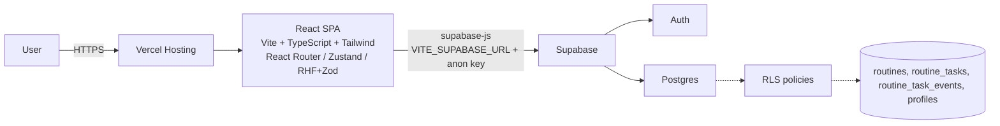
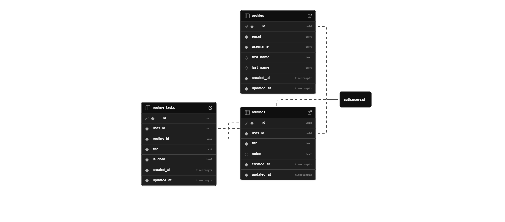

<div align="center">
  <h1>NeuroRoutine</h1>
  <p><strong>Gestor inteligente de rutinas diarias (portfolio)</strong> enfocado en UX premium y buenas prácticas de SPA + Auth + RLS.</p>
  <p><em>React, TypeScript, Vite, Tailwind CSS, Supabase (Auth + Postgres + RLS), React Router, Zustand, React Hook Form, Zod, GitHub Actions, Vercel</em></p>
  <p><a href="https://neuroroutine.vercel.app/">Demo en vivo: neuroroutine.vercel.app</a></p>
  <p><a href="./README.md">Leer en inglés</a></p>

  <p>
    <a href="https://github.com/TomasPosada0626/Neuroroutine/actions/workflows/ci.yml">
      
    </a>
    <a href="https://github.com/TomasPosada0626/Neuroroutine/actions/workflows/deploy-vercel.yml">
      
    </a>
    
  </p>

  <p>
    
    
    
    
    
    
    
    
    
  </p>
</div>

---

## Tabla de contenidos

- [Resumen](#resumen)
- [Alcance y no-objetivos](#alcance-y-no-objetivos)
- [Galería](#galeria)
- [Funcionalidades](#funcionalidades)
- [Stack tecnológico](#stack-tecnologico)
- [Decisiones clave](#decisiones-clave)
- [Arquitectura](#arquitectura)
- [Modelo de datos](#modelo-de-datos)
- [Migraciones de base de datos](#migraciones-de-base-de-datos)
- [Superficie de API](#superficie-de-api)
- [Seguridad](#seguridad)
- [Pruebas y calidad](#pruebas-y-calidad)
- [Rendimiento y UX](#rendimiento-y-ux)
- [Estructura del repo](#estructura-del-repo)
- [Rutas principales](#rutas-principales)
- [Requisitos](#requisitos)
- [Variables de entorno](#variables-de-entorno)
- [Desarrollo local](#desarrollo-local)
- [Scripts](#scripts)
- [Backend (Supabase)](#backend-supabase)
- [CI/CD](#cicd)
- [Despliegue](#despliegue)
- [Solución de problemas](#solucion-de-problemas)
- [Hoja de ruta](#hoja-de-ruta)
- [Contribuir](#contribuir)
- [Registro de cambios](#registro-de-cambios)
- [Autor](#autor)
- [Licencia](#licencia)

---

## Resumen

NeuroRoutine es una web app lista para portfolio para planificar **rutinas y tareas** con persistencia real, autenticación y **seguridad a nivel de base de datos** mediante Supabase RLS.

## Alcance y no-objetivos

Alcance (en qué se enfoca este proyecto):

- Una SPA limpia y moderna con UX premium.
- Auth y persistencia reales (Supabase Auth + Postgres).
- Acceso multi-usuario seguro garantizado por RLS en base de datos.

No-objetivos (trade-offs intencionales de este MVP para portfolio):

- Sin servidor backend propio (el frontend habla directo con Supabase).
- Sin notificaciones/cron jobs por ahora.
- No es una suite de tests exhaustiva (CI aplica lint + unit/store tests + build + Playwright smoke E2E).

## Galería

> (Agrega screenshots más adelante — se renderizarán aquí en GitHub)

Guarda las imágenes en `docs/screenshots/` con estos nombres:

- `01-landing.png`
- `02-login.png`
- `03-register.png`
- `04-dashboard.png`
- `05-routines.png`

| Paso | Vista previa |
|---|---|
| Inicio |  |
| Iniciar sesión |  |
| Registro |  |
| Dashboard |  |
| Rutinas/Tareas |  |

## Funcionalidades

- Supabase Auth (registro / inicio de sesión / cierre de sesión) + manejo de sesión.
- Rutas protegidas (solo usuarios autenticados pueden acceder al área de la app).
- CRUD real en Postgres para rutinas y tareas.
- Dashboard de analíticas (KPIs + heatmap de actividad + métricas por rutina + gráficas).
- Historial de completitud a nivel analítico vía registro de eventos (rachas/consistencia precisas).
- UI moderna con Tailwind y layouts reutilizables.
- Tema día/noche persistente (estado global con persistencia en localStorage).
- Despliegue amigable para SPA (sin 404 al refrescar rutas del lado cliente).

## Stack tecnológico

**Frontend**

- React + TypeScript (SPA)
- Vite (herramienta de build)
- Tailwind CSS (estilos)
- React Router (ruteo)
- Zustand (estado global + persistencia)
- React Hook Form + Zod (formularios + validación)

**Backend**

- Supabase Auth
- Postgres
- Row Level Security (RLS) + políticas por usuario

**DevOps**

- GitHub Actions (CI)
- Vercel (despliegue recomendado)

## Decisiones clave

- **Supabase + RLS**: backend real sin servidor custom, con seguridad aplicada en base de datos (cada usuario solo ve sus datos).
- **Zustand**: estado global simple y performante (por ejemplo, tema persistente y stores de features) sin boilerplate.
- **React Hook Form + Zod**: formularios rápidos con validación declarativa y tipada para UX consistente.
- **SPA rewrite en Vercel**: React Router requiere un rewrite a `index.html` para evitar 404 al refrescar rutas como `/login`.
- **Registro de eventos para analíticas**: se guardan eventos de completitud en Postgres para calcular rachas, consistencia y gráficas con historial real.

## Arquitectura

Enfoque de alto nivel:

- **frontend/**: SPA React (UI, routing, forms, state).
- **backend/**: schema + políticas RLS de Supabase (SQL) y documentación.

El frontend habla directo con Supabase usando la anon key pública; el control de acceso se aplica en Postgres vía RLS.



### Estructura del frontend (alto nivel)

Dentro de `frontend/src/`:

- `app/`: router + bootstrap
- `pages/`: páginas por ruta (inicio/auth/app)
- `features/`: lógica por feature (auth, routines, etc.)
- `shared/`: UI/layout/lib/api reutilizables

Convenciones:

- Alias `@/` apunta a `frontend/src/`.
- Preferir imports desde barrels (p.ej. `@/shared/ui`).

## Modelo de datos

El modelo está versionado en `backend/supabase/schema.sql`.

Diagrama ER: `docs/diagrams/er-diagram.png` (guía en `docs/diagrams/README.md`).



### Entidades

| Tabla | Propósito | Campos clave |
|---|---|---|
| `profiles` | Perfil de usuario (nivel app) | `id` (UUID = `auth.users.id`), `email`, `username`, `first_name`, `last_name` |
| `routines` | Rutinas del usuario | `id`, `user_id`, `title`, `notes` |
| `routine_tasks` | Tareas dentro de una rutina | `id`, `user_id`, `routine_id`, `title`, `is_done`, `completed_at` |
| `routine_task_events` | Historial de eventos de completitud | `id`, `user_id`, `routine_id`, `routine_task_id`, `event_type`, `created_at` |

### Relaciones

```text
auth.users (Supabase Auth)
  1 ── 1  profiles

auth.users
  1 ── *  routines

routines
  1 ── *  routine_tasks

routine_tasks
  1 ── *  routine_task_events
```

## Superficie de API

Operaciones principales que el frontend realiza contra Supabase:

- **Auth**: registro / inicio de sesión / cierre de sesión + lectura de sesión.
- **Lecturas (SELECT)**: traer rutinas y tareas del usuario autenticado.
- **Escrituras (INSERT/UPDATE/DELETE)**: crear/actualizar/eliminar rutinas, alternar completitud de tareas.
- **Perfil**: leer `profiles` (filtrado por RLS) y soportar inicio de sesión por nombre de usuario (helper SQL).

## Seguridad

Lista de verificación:

- RLS habilitado en `profiles`, `routines`, `routine_tasks`.
- Políticas por usuario: acceso permitido solo cuando `auth.uid()` coincide con el dueño (`user_id` o `profiles.id`).
- Público vs privado:
  - Privado: rutinas y tareas (siempre scoped por usuario).
  - Perfil: solo accesible por el mismo usuario.
  - Nota: `get_email_by_username()` existe (security definer) para habilitar nombre de usuario → email en login; los nombres de usuario no deberían ser sensibles.
- Gestión de claves:
  - OK en frontend: `VITE_SUPABASE_ANON_KEY` (pública) + RLS.
  - Nunca en frontend: Supabase `service_role` key.

### Prueba de seguridad (RLS)

Puedes reproducir el comportamiento de RLS en el SQL Editor de Supabase simulando requests autenticadas (claims del JWT).

> Reemplaza `USER_A_UUID` y `USER_B_UUID` por valores reales de `auth.users.id`.

**Consulta 1 — el usuario A inserta, el usuario B no puede leer**

```sql
-- As user A
select set_config('request.jwt.claim.role', 'authenticated', true);
select set_config('request.jwt.claim.sub', 'USER_A_UUID', true);

insert into public.routines (user_id, title)
values (auth.uid(), 'Routine A')
returning id, user_id, title;

-- As user B
select set_config('request.jwt.claim.sub', 'USER_B_UUID', true);

-- This will return 0 rows due to RLS (user B cannot see user A data)
select id, user_id, title
from public.routines
where title = 'Routine A';
```

**Consulta 2 — el usuario B no puede insertar en nombre del usuario A**

```sql
-- As user B
select set_config('request.jwt.claim.role', 'authenticated', true);
select set_config('request.jwt.claim.sub', 'USER_B_UUID', true);

-- This should fail with an RLS violation (cannot write rows owned by another user)
insert into public.routines (user_id, title)
values ('USER_A_UUID', 'Malicious attempt');
```

## Pruebas y calidad

- **CI**: GitHub Actions corre `npm ci`, `npm run lint`, `npm run test`, `npm run build` y un smoke suite E2E con Playwright.
- **Unit/store tests**: Vitest (ejemplos en `frontend/src/**/__tests__`).
- **E2E**: Playwright (el smoke test corre con env dummy; un test autenticado opcional se puede habilitar con variables de entorno).

Comandos útiles (desde `frontend/`):

```bash
npm run test
npm run test:coverage
npm run e2e
```

Cobertura (corrida local 2026-02-06): **52.6% sentencias**, **34.44% ramas**, **48.14% funciones**, **53.52% líneas**.

Nota: el E2E autenticado se salta a menos que configures `E2E_USER_IDENTIFIER` y `E2E_USER_PASSWORD`.

## Rendimiento y UX

- **Inicio sin scroll**: hero + vista previa en una sola vista para reducir fricción y mejorar primera impresión.
- **Tema persistente**: persistencia global del tema día/noche para una identidad consistente.
- **Accesibilidad + contraste**: inputs y controles pensados para legibilidad consistente.

## Migraciones de base de datos

Este repo mantiene ambos:

- Un **esquema completo** para inicializar un proyecto Supabase nuevo.
- Una carpeta de **migraciones** para cambios incrementales.

- `backend/supabase/schema.sql`
- `backend/supabase/migrations/`

Cómo se aplican las actualizaciones:

- En este proyecto, los cambios del esquema se aplican ejecutando SQL en Supabase (SQL Editor).
- Cuando el esquema evoluciona, se agrega una nueva migración y `schema.sql` se mantiene actualizado para que la configuración completa sea reproducible.

Chequeo de versión/capacidades del esquema:

- El backend expone `get_nr_schema_status()` para que el frontend detecte migraciones faltantes y muestre un aviso no bloqueante.

Nota: las funcionalidades de analítica (rachas/consistencia/gráficas) dependen de `routine_task_events` y del trigger definido en `backend/supabase/schema.sql`.

## Estructura del repo

```text
.
├─ frontend/                 # React + TS + Tailwind
│  ├─ src/
│  ├─ vercel.json            # SPA rewrite for React Router
│  └─ ...
├─ backend/                  # Supabase SQL/RLS + docs
│  └─ supabase/
│     ├─ migrations/
│     └─ schema.sql
├─ docs/
│  ├─ diagrams/
│  └─ screenshots/
└─ .github/workflows/        # CI + deploy
```

Para docs por área:

- `frontend/README.md`
- `backend/README.md`

## Rutas principales

- `/`: inicio
- `/login`: iniciar sesión
- `/register`: registro
- `/app`: área autenticada (protegida)

## Requisitos

- Node.js 18+ (recomendado)
- Un proyecto Supabase (creado)

## Variables de entorno

El frontend requiere (ejemplo en `frontend/.env.example`):

| Variable | Descripción |
|---|---|
| `VITE_SUPABASE_URL` | URL del proyecto Supabase |
| `VITE_SUPABASE_ANON_KEY` | Anon key pública |
| `VITE_SENTRY_DSN` | (Opcional) DSN de Sentry para tracking de errores en frontend |

## Observabilidad

- **Sentry (frontend)**: opcional. Cuando `VITE_SENTRY_DSN` está configurado, la app inicializa Sentry con `sendDefaultPii: false`.
- **Registro de eventos (DB)**: `public.app_events` guarda eventos mínimos de producto (sin PII). Los inserts son best-effort y nunca bloquean UX.

## Desarrollo local

1) Instalar dependencias

```bash
cd frontend
npm install
```

2) Crear `.env`

```bash
cd frontend
cp .env.example .env
```

Alternativa Windows:

```bash
cd frontend
copy .env.example .env
```

3) Completar `frontend/.env`

4) Levantar dev server

```bash
npm run dev
```

## Scripts

Desde `frontend/`:

- `npm run dev`: desarrollo
- `npm run build`: build de producción
- `npm run lint`: lint
- `npm run preview`: previsualizar el build de producción localmente

## Backend (Supabase)

Supabase se usa como backend real (Auth + Postgres). El schema y las políticas RLS viven en:

- `backend/supabase/schema.sql`

Setup rápido:

1) Crear un proyecto Supabase
2) Supabase → SQL Editor: ejecutar `backend/supabase/schema.sql`
3) Habilitar proveedores de Auth según necesidad (Email por defecto; OAuth opcional)
4) Configurar `VITE_SUPABASE_URL` y `VITE_SUPABASE_ANON_KEY`

## CI/CD

### CI (GitHub Actions)

Workflow: `.github/workflows/ci.yml`

En cada push a `main` y PRs:

- instalar deps (`npm ci`)
- correr lint (`npm run lint`)
- build (`npm run build`)

### CD (Despliegue)

Recomendado: conectar el repo a **Vercel** para deploys automáticos.

También existe un workflow opcional de despliegue con GitHub Actions:

- `.github/workflows/deploy-vercel.yml`

## Despliegue

### Vercel (recomendado)

Config sugerida de Vercel:

- Root Directory (directorio raíz): `frontend`
- Build Command (comando de build): `npm run build`
- Output Directory (directorio de salida): `dist`
- Variables de entorno:
  - `VITE_SUPABASE_URL`
  - `VITE_SUPABASE_ANON_KEY`

### SPA routing (evitar 404 al refrescar)

React Router necesita un rewrite a SPA para que refrescar rutas como `/login` funcione:

- `frontend/vercel.json`

## Solución de problemas

- 404 al refrescar: verifica que el root del proyecto sea `frontend` y que `frontend/vercel.json` esté incluido.
- Problemas de Auth: valida `VITE_SUPABASE_URL` y `VITE_SUPABASE_ANON_KEY` local y en el proveedor de despliegue.
- RLS bloquea escrituras: confirma que el usuario esté autenticado y revisa políticas en `backend/supabase/schema.sql`.

## Hoja de ruta

Ideas para empujar esto hacia producto:

- Notificaciones/recordatorios
- Edición avanzada de tareas
- Orden con drag & drop
- Más analíticas (calidad de insights, export, tendencias por tarea)
- Cache offline liviana

## Contribuir

Contribuciones bienvenidas.

Antes de abrir un PR:

- Instala deps: `npm ci` (dentro de `frontend/`)
- Corre lint: `npm run lint`
- Verifica build: `npm run build`

Guías para PR:

- Mantén PRs pequeños y enfocados.
- Incluye una descripción clara y, si aplica, actualiza [Galería](#galeria).
- Nunca commitees secretos. Usa `.env` local y env vars del proveedor.

## Registro de cambios

- **MVP (SPA + Auth + RLS)**: frontend React + Supabase Auth con Postgres y RLS por usuario.
- **Real CRUD**: rutinas y tareas persistidas con seguridad por fila.
- **UX/UI premium**: inicio sin scroll con vista previa, tema persistente y despliegue listo para SPA.
- **Analíticas pro en dashboard**: heatmap + gráficas por rutina alimentadas por un registro de eventos de completitud.

## Autor

Tomas Posada

- Email: tomasposada67@gmail.com

## Licencia

MIT — ver `LICENSE`.
