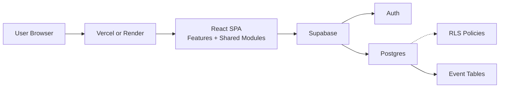

<div align="center">
  <h1>NeuroRoutine</h1>
  <p><strong>Full-stack routine and task management SPA</strong> with secure multi-user architecture and production-oriented engineering practices.</p>
  <p><em>Built by Tomas Posada as a portfolio + practicum project focused on architecture, reliability, and user experience.</em></p>
  <p><em>React 19, TypeScript, Vite, Tailwind CSS, Supabase (Auth + Postgres + RLS), Zustand, TanStack Query, React Hook Form, Zod</em></p>
  <p><a href="https://neuroroutine.vercel.app/">Live demo: neuroroutine.vercel.app</a></p>

  <p>
    <a href="https://github.com/TomasPosada0626/Neuroroutine/actions/workflows/ci.yml">
      
    </a>
    <a href="https://github.com/TomasPosada0626/Neuroroutine/actions/workflows/deploy-vercel.yml">
      
    </a>
    <a href="https://github.com/TomasPosada0626/Neuroroutine/actions/workflows/deploy-render.yml">
      
    </a>
    
  </p>
</div>

---

## Table of Contents

- [Quick Start](#quick-start)
- [Project Overview](#project-overview)
- [Personal Engineering Focus](#personal-engineering-focus)
- [Feature Highlights](#feature-highlights)
- [Architecture](#architecture)
- [Technology Stack](#technology-stack)
- [Data Model](#data-model)
- [Security Model](#security-model)
- [Offline and Reminder Flows](#offline-and-reminder-flows)
- [Testing and Quality](#testing-and-quality)
- [Deployment](#deployment)
- [Project Structure](#project-structure)
- [Roadmap (Future Advances)](#roadmap-future-advances)
- [Documentation Index](#documentation-index)
- [Author](#author)
- [License](#license)

---

## Quick Start

```bash
cd frontend
copy .env.example .env.local
npm install
npm run dev
```

Set the required variables in `frontend/.env.local`:

- `VITE_SUPABASE_URL`
- `VITE_SUPABASE_ANON_KEY`

Open `http://localhost:5173`.

---

## Project Overview

NeuroRoutine is a production-style single-page application for building routines, managing tasks, and tracking completion consistency over time.

Core goals of this project:

- Deliver a complete auth + data experience without a custom backend server.
- Enforce security at the database layer through Supabase Row-Level Security (RLS).
- Keep architecture modular and maintainable with clear boundaries.
- Ship with CI, tests, and deploy automation as first-class requirements.

---

## Personal Engineering Focus

I built NeuroRoutine to represent how I approach software projects end-to-end:

- Product mindset: prioritize user value and iteration speed.
- Architecture discipline: keep features isolated and dependencies intentional.
- Security by design: trust database policies over frontend assumptions.
- Operational quality: test, build, and deploy checks are part of the definition of done.

---

## Feature Highlights

- Email/password authentication with Supabase Auth.
- Protected routes for authenticated app access.
- Full CRUD for routines and tasks.
- Dashboard analytics with streaks, activity heatmap, and per-routine insights.
- Event-driven completion history for reliable metrics.
- Remote routine search with layered fallback strategy.
- Theme persistence (day/night) through global UI state.
- Offline-first task creation queue using IndexedDB.
- Automatic task sync when connectivity returns.
- Service worker app-shell caching baseline.
- Reminder foundation with user preferences + scheduled Edge Function pipeline.

---

## Architecture

High-level architecture:

- `frontend/`: React SPA, feature modules, shared UI/state/lib.
- `backend/`: Supabase schema, migrations, and Edge Functions.
- Frontend communicates directly with Supabase using the public anon key.
- Data access is constrained by Postgres RLS policies.



---

## Technology Stack

Frontend:

- React 19 + TypeScript
- Vite + Tailwind CSS
- React Router
- Zustand + TanStack Query
- React Hook Form + Zod

Backend:

- Supabase Auth
- Supabase Postgres
- SQL migrations + RLS policies
- Supabase Edge Functions

DevOps and quality:

- GitHub Actions CI
- Vercel and Render deployment workflows
- Vitest + Testing Library + Playwright

---

## Data Model

Primary entities:

- `profiles`: app user profile metadata.
- `routines`: user-owned routine definitions.
- `routine_tasks`: task items within routines.
- `routine_task_events`: completion/uncompletion history.
- `app_events`: product-level event stream.
- `reminder_preferences`: user reminder configuration.

Schema sources:

- `backend/supabase/schema.sql`
- `backend/supabase/migrations/`

---

## Security Model

Security is enforced in Postgres, not trusted to frontend logic:

- RLS enabled on user-owned tables.
- Policies based on `auth.uid()` ownership checks.
- Public anon key is safe when paired with strict RLS.
- Service role key is never used in frontend code.

This model ensures each authenticated user can only read/write their own records.

---

## Offline and Reminder Flows

Offline task flow:

1. Task is created while offline.
2. Task is queued in IndexedDB.
3. UI reflects local state immediately.
4. Queue syncs automatically when the client is online again.

Reminder flow:

1. User reminder preferences are stored in `reminder_preferences`.
2. `send-due-reminders` Edge Function scans due tasks.
3. Function writes `reminder_due_task` entries to `app_events`.
4. Scheduled execution enables daily automated reminder preparation.

---

## Testing and Quality

Quality gates are integrated into the workflow:

- ESLint for static quality.
- TypeScript build checks for type safety.
- Vitest for unit/store/component testing.
- Playwright for smoke E2E coverage.
- CI runs on push/PR through GitHub Actions.

Run locally:

```bash
cd frontend
npm run lint
npm run test
npm run build
npm run e2e
```

---

## Deployment

Supported deployment paths:

- Vercel (primary)
- Render (alternative)

Backend runtime:

- Supabase cloud project with migrations and Edge Functions.

Useful backend commands:

```bash
cd backend
npx supabase migration list
npx supabase db push
npx supabase functions deploy send-due-reminders --project-ref <project-ref>
```

---

## Project Structure

```text
NeuroRoutine/
  frontend/
    src/
      app/
      pages/
      features/
      shared/
    public/
  backend/
    supabase/
      migrations/
      functions/
      schema.sql
  docs/
  ARCHITECTURE.md
```

---

## Roadmap (Future Advances)

Next planned improvements:

- Full reminder delivery providers (email and push channels).
- Richer offline UX signals and conflict-resolution strategy.
- Expanded search/filter experience in dashboard UI.
- Higher automated test depth across advanced user flows.
- Progressive enhancement of analytics and insights.
- Expanded observability around background jobs and sync reliability.

---

## Documentation Index

- Main architecture: `ARCHITECTURE.md`
- Backend setup and security notes: `backend/README.md`
- Edge Functions notes: `backend/supabase/functions/README.md`
- Metrics and career-facing summary: `docs/career/metrics.md`
- Deployment notes: `docs/deployment/`

---

## Author

Tomas Posada

- GitHub: [TomasPosada0626](https://github.com/TomasPosada0626)
- Email: tomasposada67@gmail.com

---

## License

MIT. See `LICENSE`.
