<div align="center">
  <h1>NeuroRoutine</h1>
  <p><strong>Smart daily routines manager (portfolio)</strong> focused on premium UX and solid SPA + Auth + RLS practices.</p>
  <p><em>React, TypeScript, Vite, Tailwind CSS, Supabase (Auth + Postgres + RLS), React Router, Zustand, React Hook Form, Zod, GitHub Actions, Vercel, Render</em></p>
  <p><a href="https://neuroroutine.vercel.app/">Live demo: neuroroutine.vercel.app</a></p>

  <p>
    <a href="https://github.com/TomasPosada0626/Neuroroutine/actions/workflows/ci.yml">
      
    </a>
    <a href="https://github.com/TomasPosada0626/Neuroroutine/actions/workflows/deploy-vercel.yml">
      
    </a>
    <a href="https://github.com/TomasPosada0626/Neuroroutine/actions/workflows/deploy-render.yml">
      
    </a>
    
  </p>

  <p>
    
    
    
    
    
    
    
    
    
  </p>
</div>

---

## Table of Contents

- [Quick Start (60s)](#quick-start-60s)
- [Overview](#overview)
- [Scope & Non-goals](#scope--non-goals)
- [Gallery](#gallery)
- [Features](#features)
- [Tech Stack](#tech-stack)
- [Key Decisions](#key-decisions)
- [Architecture](#architecture)
- [Architecture Guide](#architecture-guide)
- [Data Model](#data-model)
- [Database Migrations](#database-migrations)
- [API Surface](#api-surface)
- [Security](#security)
- [Testing & Quality](#testing--quality)
- [Performance & UX](#performance--ux)
- [Repo Structure](#repo-structure)
- [Main Routes](#main-routes)
- [Runtime/Deploy Matrix](#runtimedeploy-matrix)
- [Requirements](#requirements)
- [Environment Variables](#environment-variables)
- [Local Development](#local-development)
- [Scripts](#scripts)
- [Backend (Supabase)](#backend-supabase)
- [CI/CD](#cicd)
- [Deploy](#deploy)
- [Known Checks](#known-checks)
- [Troubleshooting](#troubleshooting)
- [Roadmap](#roadmap)
- [Contributing](#contributing)
- [Changelog](#changelog)
- [Career Metrics (CV/LinkedIn)](#career-metrics-cvlinkedin)
- [Author](#author)
- [License](#license)

---

## Overview

NeuroRoutine is a portfolio-ready web app for planning **routines and tasks** with real persistence, authentication, and strong **database-level security** via Supabase RLS.

## Quick Start (60s)

```bash
cd frontend
copy .env.example .env.local
npm install
npm run dev
```

Fill these values in `frontend/.env.local` before running:

- `VITE_SUPABASE_URL`
- `VITE_SUPABASE_ANON_KEY`

Then open `http://localhost:5173` in your browser.

## Scope & Non-goals

Scope (what this project focuses on):

- A clean, modern SPA with a premium UX.
- Real auth + persistence (Supabase Auth + Postgres).
- Secure multi-user access enforced via database RLS.

Non-goals (intentional trade-offs for this portfolio MVP):

- No custom backend server (the frontend talks directly to Supabase).
- No notifications/cron jobs yet.
- Not an exhaustive test suite (CI enforces lint + unit/store tests + build + Playwright smoke E2E).

## Gallery

| Step | Light | Dark |
|---|---|---|
| Landing | 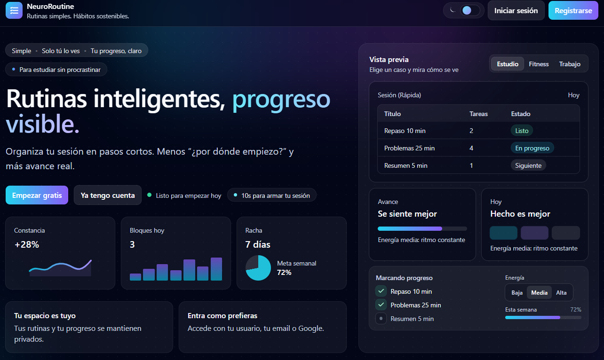 | 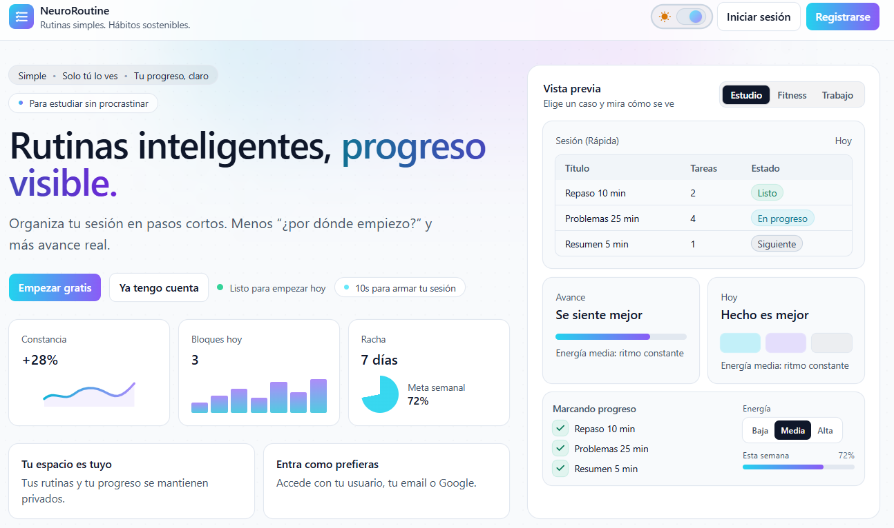 |
| Login | 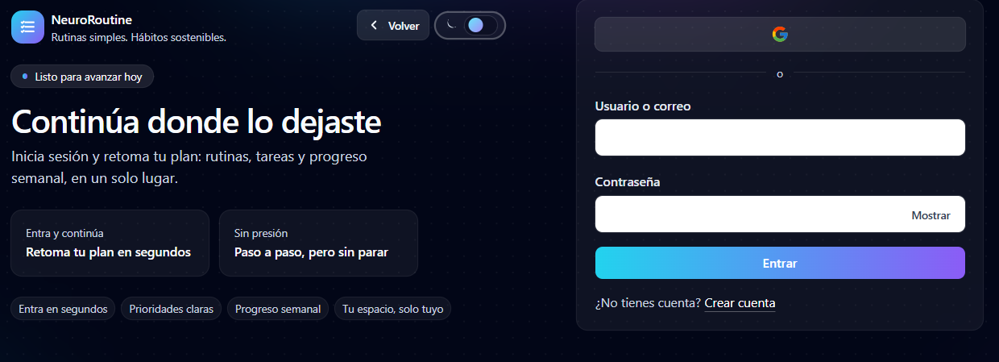 | 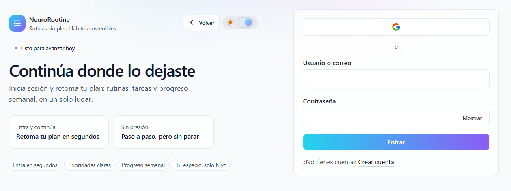 |
| Register | 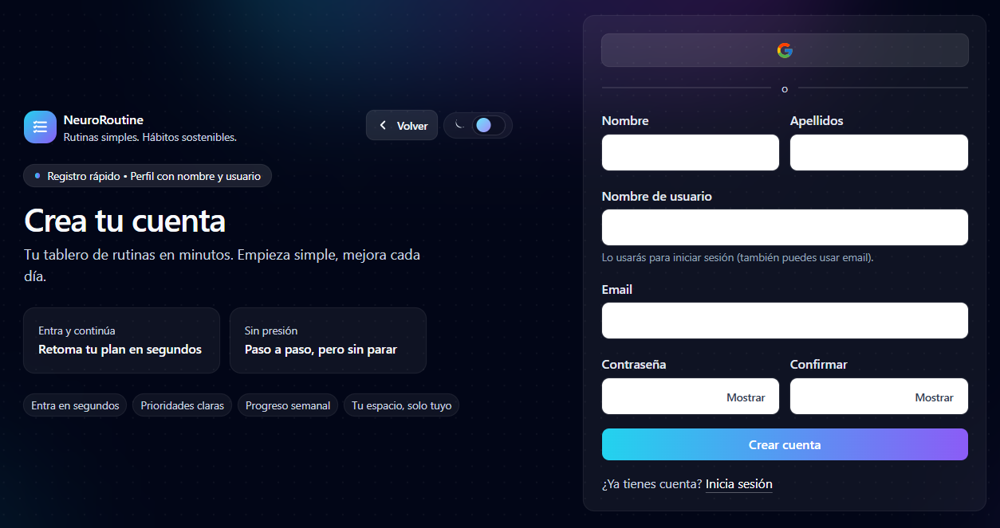 | 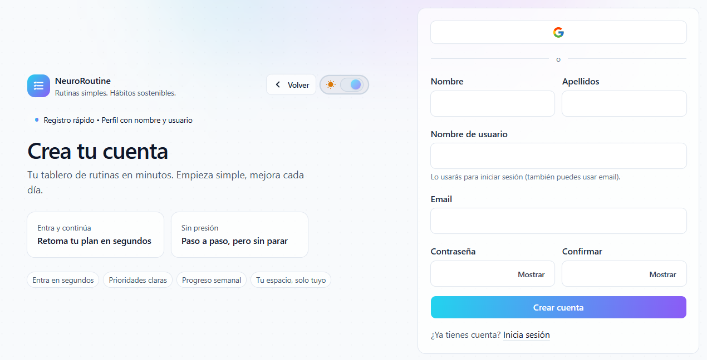 |
| Dashboard | 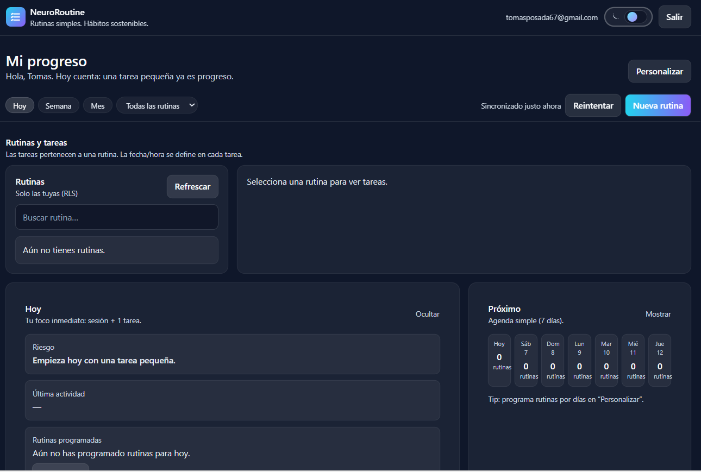 | 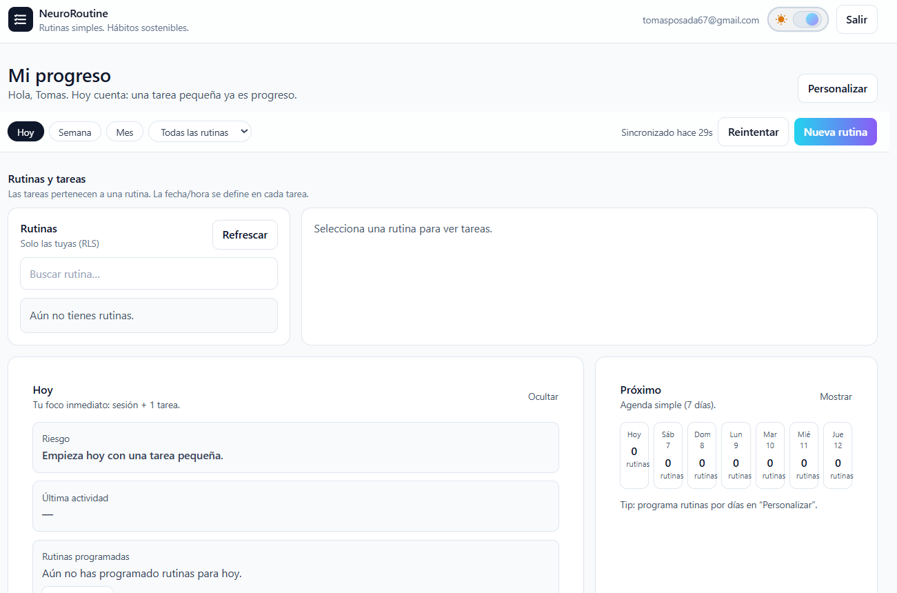 |
| Routines/Tasks | 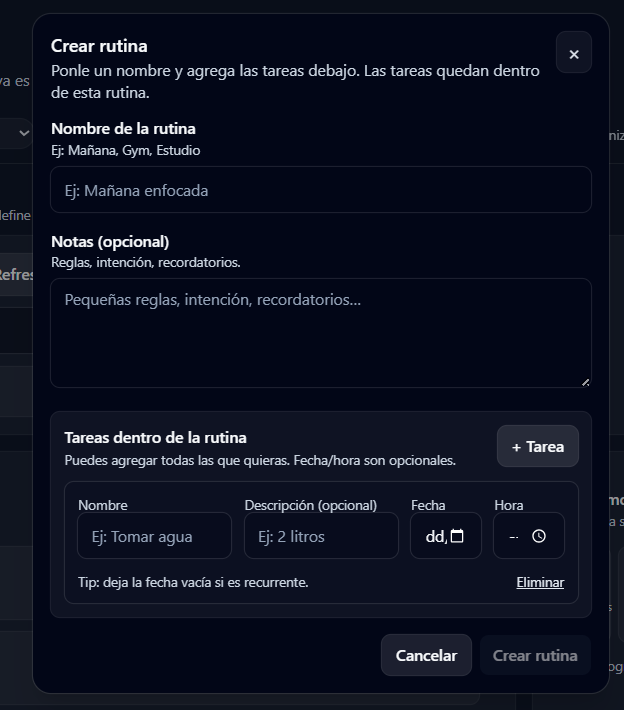 | 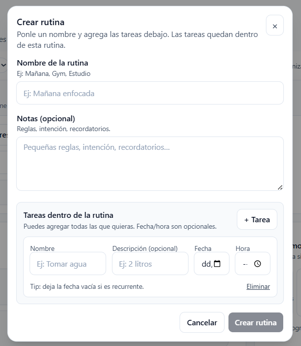 |

## Features

- Supabase Auth (register/login/logout) + session handling.
- Protected routes (only authenticated users can access the app area).
- Real CRUD over Postgres for routines and tasks.
- Analytics dashboard (KPIs + activity heatmap + per-routine metrics + charts).
- Analytics-grade completion history via event log (accurate streaks/consistency).
- Modern Tailwind UI with reusable layouts.
- Persistent day/night theme (global state with localStorage persistence).
- SPA-friendly deploy (no 404 on refresh for client-side routes).

## Tech Stack

**Frontend**

- React + TypeScript (SPA)
- Vite (build tool)
- Tailwind CSS (styling)
- React Router (routing)
- Zustand (global state + persistence)
- React Hook Form + Zod (forms + validation)

**Backend**

- Supabase Auth
- Postgres
- Row Level Security (RLS) + per-user policies

**DevOps**

- GitHub Actions (CI)
- Vercel / Render (deploy options)

## Key Decisions

- **Supabase + RLS**: real backend without a custom server, with strong database-enforced security (each user only sees their own data).
- **Zustand**: simple, performant global state (e.g. persistent theme and feature stores) without boilerplate.
- **React Hook Form + Zod**: fast forms with typed, declarative validation for consistent UX.
- **SPA rewrite on Vercel**: React Router needs an `index.html` rewrite to avoid 404 on refresh for routes like `/login`.
- **Event log for analytics**: completion events are stored in Postgres to compute streaks, consistency, and charts from real history.

## Architecture

High-level approach:

- **frontend/**: React SPA (UI, routing, forms, state).
- **backend/**: Supabase schema + RLS policies (SQL) and documentation.

Frontend talks directly to Supabase using the public anon key; access control is enforced in Postgres through RLS.

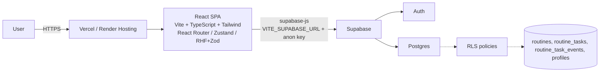

## Architecture Guide

For architecture boundaries, dependency rules, and feature evolution conventions:

- `ARCHITECTURE.md`

### Frontend structure (high level)

Inside `frontend/src/`:

- `app/`: router + bootstrap
- `pages/`: route pages (landing/auth/app)
- `features/`: feature-based logic (auth, routines, etc.)
- `shared/`: reusable UI/layout/lib/api

Conventions:

- Alias `@/` points to `frontend/src/`.
- Prefer imports from barrels (e.g. `@/shared/ui`).

## Data Model

The model is versioned in `backend/supabase/schema.sql`.

Source of truth for data model and relationships:

- `backend/supabase/schema.sql`
- `backend/supabase/migrations/`

### Entities

| Table | Purpose | Key fields |
|---|---|---|
| `profiles` | User profile (app-level) | `id` (UUID = `auth.users.id`), `email`, `username`, `first_name`, `last_name` |
| `routines` | User routines | `id`, `user_id`, `title`, `notes` |
| `routine_tasks` | Tasks within a routine | `id`, `user_id`, `routine_id`, `title`, `is_done`, `completed_at` |
| `routine_task_events` | Completion event history | `id`, `user_id`, `routine_id`, `routine_task_id`, `event_type`, `created_at` |

### Relationships

```text
auth.users (Supabase Auth)
  1 ── 1  profiles

auth.users
  1 ── *  routines

routines
  1 ── *  routine_tasks

routine_tasks
  1 ── *  routine_task_events
```

## API Surface

Main operations the frontend performs against Supabase:

- **Auth**: sign up / sign in / sign out + session reading.
- **Reads (SELECT)**: fetch routines and tasks for the authenticated user.
- **Writes (INSERT/UPDATE/DELETE)**: create/update/delete routines, toggle task completion.
- **Profile**: read `profiles` (RLS-scoped) and support username login (SQL helper).

## Security

Checklist:

- RLS enabled on `profiles`, `routines`, `routine_tasks`.
- Per-user policies: access allowed only when `auth.uid()` matches the owner (`user_id` or `profiles.id`).
- Public vs private:
  - Private: routines and tasks (always user-scoped).
  - Profile: only accessible by the same user.
  - Note: `get_email_by_username()` exists (security definer) to enable username → email lookup for login; usernames should not be sensitive.
- Key management:
  - OK in frontend: `VITE_SUPABASE_ANON_KEY` (public) + RLS.
  - Never in frontend: Supabase `service_role` key.

### SQL injection & safe SQL functions

In this architecture, the frontend does **not** build raw SQL strings; it uses `supabase-js` query builders and RPC calls, and the database enforces RLS. That makes classic SQL injection much less likely.

The main SQLi risk surface is:

- Custom SQL functions (RPC), especially if they use dynamic SQL.
- Any place you concatenate user input into SQL.

Guidelines used here:

- Prefer static SQL (no dynamic `EXECUTE`).
- Validate/sanitize inputs (length + allowed characters) at the function boundary.
- For `SECURITY DEFINER` functions: set a safe `search_path` and grant the minimum required privileges.

Example (safe helper function shape):

```sql
create or replace function public.get_email_by_username(p_username text)
returns text
language plpgsql
security definer
set search_path = pg_catalog, public
as $$
declare
  v_username text := lower(trim(p_username));
  v_email text;
begin
  if v_username is null or v_username = '' then
    return null;
  end if;

  -- Allow only [a-z0-9_], 3..30 chars.
  if v_username !~ '^[a-z0-9_]{3,30}$' then
    raise exception 'invalid username';
  end if;

  select email into v_email
  from public.profiles
  where username = v_username
  limit 1;

  return v_email;
end;
$$;

revoke all on function public.get_email_by_username(text) from public;
grant execute on function public.get_email_by_username(text) to anon, authenticated;
```

### Security proof (RLS)

You can reproduce RLS behavior in the Supabase SQL Editor by simulating authenticated requests (JWT claims).

> Replace `USER_A_UUID` and `USER_B_UUID` with real `auth.users.id` values.

**Query 1 — user A inserts, user B cannot read**

```sql
-- As user A
select set_config('request.jwt.claim.role', 'authenticated', true);
select set_config('request.jwt.claim.sub', 'USER_A_UUID', true);

insert into public.routines (user_id, title)
values (auth.uid(), 'Routine A')
returning id, user_id, title;

-- As user B
select set_config('request.jwt.claim.sub', 'USER_B_UUID', true);

-- This will return 0 rows due to RLS (user B cannot see user A data)
select id, user_id, title
from public.routines
where title = 'Routine A';
```

**Query 2 — user B cannot insert on behalf of user A**

```sql
-- As user B
select set_config('request.jwt.claim.role', 'authenticated', true);
select set_config('request.jwt.claim.sub', 'USER_B_UUID', true);

-- This should fail with an RLS violation (cannot write rows owned by another user)
insert into public.routines (user_id, title)
values ('USER_A_UUID', 'Malicious attempt');
```

## Testing & Quality

- **CI**: GitHub Actions runs `npm ci`, `npm run lint`, `npm run test`, `npm run build`, and a Playwright E2E smoke suite.
- **Unit/store tests**: Vitest (examples live under `frontend/src/**/__tests__`).
- **E2E**: Playwright (smoke test runs with dummy Supabase env; an optional real-auth test can be enabled via env vars).

Useful commands (from `frontend/`):

```bash
npm run test
npm run test:coverage
npm run e2e
```

Coverage (local run on 2026-02-06): **52.6% statements**, **34.44% branches**, **48.14% functions**, **53.52% lines**.

Note: the authenticated E2E test is skipped unless you set `E2E_USER_IDENTIFIER` and `E2E_USER_PASSWORD`.

## Performance & UX

- **Scroll-free landing**: hero + preview in a single view to reduce friction and improve first impression.
- **Persistent theme**: global day/night theme persistence for consistent identity.
- **Accessibility + contrast**: inputs and controls are designed for consistent readability.

## Database Migrations

This repo keeps both:

- A **full schema** for bootstrapping a fresh Supabase project.
- A **migrations folder** for incremental changes.

- `backend/supabase/schema.sql`
- `backend/supabase/migrations/`

How updates are applied:

- For this project, schema changes are applied by running the SQL in Supabase (SQL Editor).
- When the schema evolves, a new migration is added and `schema.sql` stays up-to-date so the full database setup remains reproducible.

Schema version / capability check:

- The backend exposes `get_nr_schema_status()` so the frontend can detect missing migrations and show a non-blocking warning banner.

Note: analytics features (streaks/consistency/charts) rely on `routine_task_events` and the trigger defined in `backend/supabase/schema.sql`.

## Repo Structure

```text
.
├─ frontend/                 # React + TS + Tailwind
│  ├─ src/
│  ├─ vercel.json            # SPA rewrite for React Router
│  └─ ...
├─ backend/                  # Supabase SQL/RLS + docs
│  └─ supabase/
│     ├─ migrations/
│     └─ schema.sql
├─ docs/
│  ├─ deployment/
│  ├─ screenshots/
│  └─ README.md
└─ .github/workflows/        # CI + deploy
```

For deeper docs per area:

- `frontend/README.md`
- `backend/README.md`

## Main Routes

- `/`: landing
- `/login`: login
- `/register`: register
- `/app`: authenticated area (protected)

## Runtime/Deploy Matrix

| Mode | Frontend | Backend | Best for | Notes |
|---|---|---|---|---|
| Local + Supabase Cloud | Local Vite dev server | Hosted Supabase | Daily development | Fast setup, no Docker required |
| Local + Supabase Local | Local Vite dev server | Local Supabase CLI + Docker | Full offline/local testing | Requires Docker + Supabase CLI |
| Vercel | Static build from `frontend` | Hosted Supabase | Primary public demo | Uses `frontend/vercel.json` for SPA rewrite |
| Render | Static build from `frontend` | Hosted Supabase | Alternate production deploy | Uses `render.yaml` Blueprint + SPA rewrite |

## Requirements

- Node.js 18+ (recommended)
- A Supabase project (created)

## Environment Variables

Frontend requires (example in `frontend/.env.example`):

| Variable | Description |
|---|---|
| `VITE_SUPABASE_URL` | Supabase project URL |
| `VITE_SUPABASE_ANON_KEY` | Public anon key |
| `VITE_SENTRY_DSN` | (Optional) Sentry DSN for frontend error tracking |

## Observability

- **Sentry (frontend)**: optional. When `VITE_SENTRY_DSN` is set, the app initializes Sentry with `sendDefaultPii: false`.
- **Event log (DB)**: `public.app_events` stores minimal, no-PII product events (routine/task actions). Inserts are best-effort and never block UX.

## Local Development

This project has no custom backend server. The frontend talks directly to Supabase.

Mode A (recommended): frontend local + Supabase cloud backend

1) Install dependencies

```bash
cd frontend
npm install
```

2) Create `.env.local`

```bash
cd frontend
cp .env.example .env.local
```

Windows alternative:

```bash
cd frontend
copy .env.example .env.local
```

3) Fill `frontend/.env.local`

4) Run dev server

```bash
npm run dev
```

Mode B (optional): frontend local + Supabase local backend

- Start a local Supabase stack with Supabase CLI and Docker.
- Run the SQL from `backend/supabase/schema.sql` (or incremental migrations from `backend/supabase/migrations/`).
- Point `frontend/.env.local` to local Supabase values (`VITE_SUPABASE_URL` and `VITE_SUPABASE_ANON_KEY`).

## Scripts

From `frontend/`:

- `npm run dev`: development
- `npm run build`: production build
- `npm run lint`: lint
- `npm run preview`: build + preview production locally
- `npm run preview:only`: preview without rebuilding (requires `dist/`)
- `npm run preview:port`: build + preview on an alternate port (avoids port-in-use)

## Backend (Supabase)

Supabase is used as the real backend (Auth + Postgres). Schema and RLS policies live in:

- `backend/supabase/schema.sql`

Quick setup:

1) Create a Supabase project
2) Supabase → SQL Editor: run `backend/supabase/schema.sql`
3) Enable Auth providers as needed (Email by default; OAuth optional)
4) Configure `VITE_SUPABASE_URL` and `VITE_SUPABASE_ANON_KEY`

## CI/CD

### CI (GitHub Actions)

Workflow: `.github/workflows/ci.yml`

On each push to `main` and on PRs:

- install deps (`npm ci`)
- run lint (`npm run lint`)
- build (`npm run build`)

### CD (Deploy)

Recommended: connect the repo to **Vercel** or **Render** for automatic deploys.

Optional GitHub Actions deploy workflows also exist:

- `.github/workflows/deploy-vercel.yml`
- `.github/workflows/deploy-render.yml`

## Known Checks

- If Vercel is connected natively to the repository, production deploys may succeed even when the optional GitHub deploy workflow check is failing or skipped.
- To avoid noisy status checks, use one deploy strategy as primary: native Vercel integration or GitHub Actions deploy workflow.
- The CI workflow (`.github/workflows/ci.yml`) remains the source of truth for code quality checks.

## Deploy

Full deployment and runtime guide:

- `docs/deployment/README.md`

### Vercel (recommended)

Suggested Vercel config:

- Root Directory: `frontend`
- Build Command: `npm run build`
- Output Directory: `dist`
- Env vars:
  - `VITE_SUPABASE_URL`
  - `VITE_SUPABASE_ANON_KEY`

### Render

This repo includes a Render Blueprint file:

- `render.yaml`

Render setup (using Blueprint):

- Service type: Static Site
- Root Directory: `frontend`
- Build Command: `npm ci && npm run build`
- Publish Directory: `dist`
- SPA rewrite: `/* -> /index.html` (already in `render.yaml`)
- Env vars:
  - `VITE_SUPABASE_URL`
  - `VITE_SUPABASE_ANON_KEY`

### SPA routing (avoid 404 on refresh)

React Router needs a SPA rewrite so refreshing routes like `/login` works:

- `frontend/vercel.json`

## Troubleshooting

- 404 on refresh: verify the project root is `frontend` and `frontend/vercel.json` is included.
- 404 on refresh (Render): verify Blueprint routes include `/* -> /index.html` from `render.yaml`.
- Auth issues: validate `VITE_SUPABASE_URL` and `VITE_SUPABASE_ANON_KEY` locally and in the deploy provider.
- RLS blocks writes: confirm the user is authenticated and review policies in `backend/supabase/schema.sql`.
- Seed demo data (your user only): open `/app?seed` and use the “Demo: populate dashboard” panel.

## Roadmap

Ideas to push this towards a product:

- Notifications/reminders
- Advanced task editing
- Drag & drop ordering
- More analytics (insights quality, export, per-task trends)
- Light offline caching

## Contributing

Contributions are welcome.

Before opening a PR:

- Install deps: `npm ci` (inside `frontend/`)
- Run lint: `npm run lint`
- Verify build: `npm run build`

PR guidelines:

- Keep PRs small and focused.
- Include a clear description and, if relevant, update [Gallery](#gallery).
- Never commit secrets. Use local `.env.local` and provider env vars.

## Changelog

- **MVP (SPA + Auth + RLS)**: React frontend + Supabase Auth with Postgres and per-user RLS.
- **Real CRUD**: routines and tasks persisted with row-level security.
- **Premium UX/UI**: scroll-free landing with preview, persistent theme, and SPA-ready deploy.
- **Pro dashboard analytics**: heatmap + per-routine charts powered by a completion event log.

## Career Metrics (CV/LinkedIn)

Career-focused project metrics and wording:

- `docs/career/metrics.md`

## Author

Tomas Posada

- Email: tomasposada67@gmail.com

## License

MIT — see `LICENSE`.
