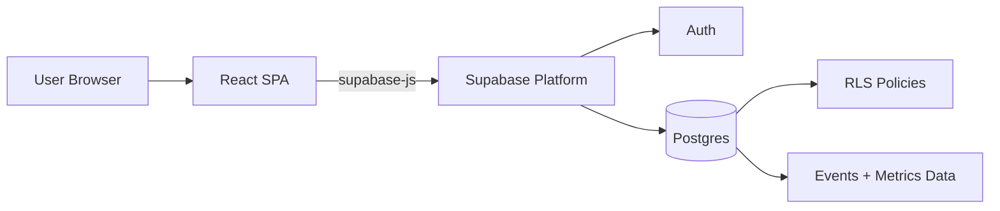

<div align="center">
  <h1>NeuroRoutine</h1>
  <p><strong>Smart daily routines manager | University Practicum Project</strong></p>
  <p><em>Full-stack SPA focused on secure architecture, practical UX, and production-ready engineering workflows.</em></p>
  <p><em>React 19, TypeScript, Vite, Tailwind CSS, Supabase (Auth + Postgres + RLS), Zustand, React Hook Form, Zod</em></p>
  <p><a href="https://neuroroutine.vercel.app/">Live Demo: neuroroutine.vercel.app</a></p>

  <p>
    <a href="https://github.com/TomasPosada0626/Neuroroutine/actions/workflows/ci.yml">
      
    </a>
    
  </p>

  <p>
    
    
    
    
    
    
    
    
    
  </p>
</div>

---

## Table of Contents

- [Quick Start (60s)](#quick-start-60s)
- [What This Project Is](#what-this-project-is)
- [Core Features [CHANGED]](#core-features-changed)
- [Architecture Overview](#architecture-overview)
- [Key Design Decisions](#key-design-decisions)
- [Tech Stack [CHANGED]](#tech-stack-changed)
- [Project Structure](#project-structure)
- [Data Model](#data-model)
- [Security](#security)
- [Testing & Quality [CHANGED]](#testing--quality-changed)
- [Setup & Local Development](#setup--local-development)
- [Deployment](#deployment)
- [Roadmap (Future Advances) [CHANGED]](#roadmap-future-advances-changed)
- [Known Limitations (Intentional MVP Trade-offs) [NEW]](#known-limitations-intentional-mvp-trade-offs-new)
- [What I Learned Building This [NEW]](#what-i-learned-building-this-new)
- [For Instructors / Evaluators [NEW]](#for-instructors--evaluators-new)
- [Contributing](#contributing)
- [Author](#author)
- [License](#license)

---

## Quick Start (60s)

Requires Node.js 24.x (see `frontend/.nvmrc`; `nvm use` picks it up automatically). This is
pinned to what Vercel's build platform actually supports today, not just the newest Node release
— check `docs/engineering/dependency-policy.md` before bumping it again.

```bash
cd frontend
copy .env.example .env.local
npm install
npm run dev
```

Configure `frontend/.env.local`:

- `VITE_SUPABASE_URL`
- `VITE_SUPABASE_ANON_KEY`

Then open `http://localhost:5173`.

---

## What This Project Is

NeuroRoutine is a full-stack university practicum MVP that demonstrates end-to-end product delivery with modern frontend architecture and secure backend design.

The project was built to prove practical capabilities in:

- Building a typed SPA with React + TypeScript.
- Integrating authentication and persistence with Supabase.
- Enforcing data isolation with Postgres Row-Level Security (RLS).
- Delivering with CI/CD and cloud deployment workflows.

Scope intent: this repository prioritizes engineering fundamentals done well over feature volume.

---

## Core Features [CHANGED]

### Authentication and Access

- Email/password sign-up and sign-in via Supabase Auth.
- Protected route access to `/app` for authenticated users.
- Session persistence and logout flow.

### Routines and Tasks

- CRUD operations for routines, **and full edit support for tasks** (title, description,
  date/time, recurring flag) — not just create-or-delete.
- Task creation, completion toggle, editing, "postpone to tomorrow", and deletion.
- Recurring tasks: mark a task as a habit and its checkbox resets every local day instead of
  staying checked off forever (see [ADR-008](docs/adr/ADR-008-recurring-tasks-daily-reset.md)),
  with an optional weekly cadence (pick specific weekdays instead of every day — see
  [ADR-011](docs/adr/ADR-011-weekly-recurring-tasks.md)) editable from the task form.
- Quick-capture chips (Hoy / Mañana / pick a date) next to the always-visible quick-add input, so
  scheduling something for later doesn't require the full routine wizard.
- Bulk task creation through the routine wizard.
- Event logging for completion/uncompletion actions.

### Dashboard and User Experience

- Activity and consistency-focused dashboard widgets.
- Streak freeze: one missed day doesn't zero out the current streak, only two in a row do
  (see [ADR-009](docs/adr/ADR-009-streak-freeze-grace-day.md)).
- Theme and dashboard preference persistence.
- Responsive layout for desktop and mobile usage.
- Installable as a PWA (`manifest.webmanifest`) with a local, no-server-required browser
  notification for tasks due today or earlier
  (see [ADR-010](docs/adr/ADR-010-client-only-fallback-notifications.md)).

### Reliability and Product Foundations

- Routine search via Postgres RPC with full-text fallback, wired to a debounced search input
  in `RoutinePanel` (RPC result → Postgres full-text search → `ilike` fallback, in that order).
- Offline-first task queue with IndexedDB persistence (service worker planned for Phase 2).
- Reminder foundation (database schema + preferences ready; Edge Function deployment pending);
  local browser notifications cover the gap in the meantime.
- Full-page accessibility verified with automated axe scans (landing, login, dashboard in
  multiple states, color contrast) as real E2E tests against the live app, not just the shared UI
  kit — see `frontend/e2e/dashboard-accessibility.spec.ts`.

---

## Architecture Overview

High-level architecture by responsibility:

- `frontend/`: UI, route orchestration, feature modules, shared components/utilities.
- `backend/`: Supabase schema, SQL migrations, Edge Function source.
- Supabase: Auth + Postgres as managed backend platform.



Architecture references:

- `ARCHITECTURE.md`
- `backend/supabase/schema.sql`
- `backend/supabase/migrations/`

---

## Key Design Decisions

1. **Database-enforced authorization (RLS)**
   - Authorization rules are applied where data lives.
   - Prevents cross-user access even if frontend requests are manipulated.

2. **Feature-first frontend structure**
   - Improves maintainability by grouping domain logic (`auth`, `routines`, `dashboard`).
   - Reduces accidental coupling across modules.

3. **Zustand for lightweight state management**
   - Low-boilerplate store model fits MVP scope well.
   - Supports clean, testable action-based patterns.

4. **Event-oriented analytics model**
   - Completion events support reliable streak and consistency calculations.
   - Keeps metric logic auditable and extendable.

5. **Migration-driven backend evolution**
   - Schema changes are tracked and reproducible.
   - Supports safe iterative releases.

---

## Tech Stack [CHANGED]

### Frontend

- React 19
- TypeScript 5
- Vite 7
- Tailwind CSS 3
- React Router 7
- Zustand
- React Hook Form + Zod

### Backend

- Supabase Auth
- Supabase Postgres
- Row-Level Security (RLS)
- SQL migrations
- Edge Function scaffolding for reminders

### Quality and Delivery

- ESLint
- Vitest + Testing Library
- Playwright (smoke + optional authenticated flows)
- GitHub Actions CI
- Vercel and Render deployment pipelines

---

## Project Structure

```text
NeuroRoutine/
├── frontend/
│   ├── src/
│   │   ├── app/
│   │   ├── pages/
│   │   ├── features/
│   │   │   ├── auth/
│   │   │   ├── routines/
│   │   │   └── dashboard/
│   │   └── shared/
│   ├── e2e/
│   ├── vite.config.ts
│   └── package.json
├── backend/
│   └── supabase/
│       ├── schema.sql
│       ├── migrations/
│       └── functions/
├── docs/
├── ARCHITECTURE.md
└── README.md
```

---

## Data Model

Main entities:

- `profiles`
- `routines`
- `routine_tasks`
- `routine_task_events`
- `app_events`
- `reminder_preferences`

Schema and migrations:

- `backend/supabase/schema.sql`
- `backend/supabase/migrations/`

The model supports both task lifecycle operations and analytics/event-based calculations.
`routine_tasks.is_recurring` marks habits, whose `is_done` flag is reset each local day by the
`reset_recurring_tasks` RPC instead of staying permanently checked (ADR-008).
`routine_tasks.recurrence_days_of_week` optionally restricts that reset to specific weekdays
instead of every day; null/empty means daily, unchanged from the original behavior (ADR-011).

---

## Security

Security design principles implemented in this project:

- RLS enabled on user-scoped data tables.
- Ownership checks bound to authenticated identity (`auth.uid()`).
- Public anon key constrained by database policies.
- Service role secrets never exposed in frontend runtime.

Practical result: user-level data boundaries are enforced by Postgres, not only by UI behavior.

---

## Testing & Quality [CHANGED]

Quality pipeline includes:

- `npm run lint`
- `npm run test`
- `npm run build`
- Backend Deno unit tests (`send-due-reminders`)
- Backend RLS pgTAP suite (11 assertions against a throwaway local Postgres — no secrets needed)
- Playwright E2E (unauthenticated smoke always; authenticated dashboard/routines/accessibility/
  analytics + RLS cross-user attack + real password-reset flow when their respective repository
  secrets are configured — see `docs/github/manual-actions-checklist.md`)
- CodeQL (SAST) and Gitleaks (secret scanning) on every push/PR

Coverage snapshot (`npm run test:coverage`, Node 24, 597 tests across 51 files), measured against
every `src/**/*.{ts,tsx}` file via `coverage.include` rather than only files a test happens to
import (a prior 94%+ snapshot silently dropped untested files from the denominator instead of
counting them as 0%, which overstated the real number — see `frontend/vite.config.ts`):

- **Statements:** 98.38%
- **Branches:** 92.67%
- **Functions:** 100%
- **Lines:** 100%

`main.tsx`, trivial API-client wiring, and the two largest route-level pages (`DashboardPage.tsx`,
`LandingPage.tsx` — already covered end-to-end by `frontend/e2e/*.spec.ts`, including a full
accessibility/axe sweep) are excluded from this metric with a documented reason each, not hidden
without explanation. The four auth pages (Login/Register/Forgot/Reset password) used to be
excluded the same way but now have dedicated unit tests and are included.

Mutation testing (`npm run test:mutation`, Stryker, scoped to `features/routines` + `shared/lib`):
last measured at **77.03%** (644 killed / 189 survived / 3 no-coverage out of 833 covered
mutants), up from 46.48% the same day. That prior number was measured with a broken `mutate` glob
that also matched the test files themselves, so Stryker was mutating test code and silently
counting those meaningless mutants as survivors. Fixing the glob, removing a dead-code Zod pattern
it surfaced, and adding exact call-argument assertions (including on fire-and-forget analytics
calls) plus multi-item test fixtures (so a `filter`/`map`/`find` mutant can't hide behind a
single-element array) raised the real score by +30.5 points. This is intentionally reported
alongside line coverage rather than instead of it: high statement coverage means the code _ran_
during tests, mutation score measures whether the assertions would actually _catch_ a bug.

**Last updated:** 2026-07-30  
CI reference: https://github.com/TomasPosada0626/Neuroroutine/actions/workflows/ci.yml

---

## Setup & Local Development

```bash
cd frontend
npm install
npm run dev
```

Useful scripts:

```bash
npm run lint
npm run test
npm run build
npm run e2e
npm run e2e:ui
```

Recommended workflow:

1. Develop with `npm run dev`.
2. Validate quality gates locally (`lint`, `test`, `build`).
3. Push changes and rely on CI for verification.

---

## Deployment

Production deployment:

- Vercel (primary): https://neuroroutine.vercel.app
- Render (alternative)

Supabase backend operations:

```bash
cd backend
npx supabase migration list
npx supabase db push
npx supabase functions deploy send-due-reminders --project-ref <project-ref>
```

---

## Roadmap (Future Advances)

### Phase 1

- Set a daily schedule for `send-due-reminders` (Dashboard -> Edge Functions -> Schedules,
  suggested cron `0 12 * * *`). The function is deployed and `RESEND_API_KEY` is configured
  (ADR-012); it currently only runs on manual invocation until a schedule is set.
- Expanded automated test depth for auth/routine critical paths.

### Phase 2

- Service worker + app-shell caching.
- Task reordering UX wired to existing drag-and-drop dependencies.
- Improved offline conflict messaging and recovery UX.

### Phase 3

- Real-time sync using Supabase Realtime subscriptions.
- Analytics export (CSV/PDF).
- Extended profile management and personalization.

---

## Known Limitations (Intentional MVP Trade-offs)

This MVP intentionally focuses on core engineering fundamentals. Current scope boundaries are explicit and planned:

| Feature               | Status                     | Reason                                                                                                                                                                                                                                                                                | Phase   |
| --------------------- | -------------------------- | ------------------------------------------------------------------------------------------------------------------------------------------------------------------------------------------------------------------------------------------------------------------------------------- | ------- |
| **Service Worker**    | Implemented                | App-shell caching (`public/sw.js`) + installable PWA manifest; IndexedDB queue covers offline writes                                                                                                                                                                                  | —       |
| **Notifications**     | Deployed, schedule pending | Browser Notification API covers same-day reminders (ADR-010); `send-due-reminders` sends real email via Resend (ADR-012) and is deployed with `RESEND_API_KEY` configured, but has no recurring schedule set yet — runs only on manual invocation until one is added in the Dashboard | Phase 1 |
| **Task Reordering**   | Foundation ready           | `@dnd-kit` installed; interaction wiring pending                                                                                                                                                                                                                                      | Phase 2 |
| **User Profile Edit** | Basic profile only         | Authentication and profile base exist; edit UX planned                                                                                                                                                                                                                                | Phase 2 |
| **Analytics Export**  | Planned                    | CSV/PDF export not in MVP scope                                                                                                                                                                                                                                                       | Phase 3 |
| **Real-time Sync**    | Planned                    | Current sync model is pull-based; realtime planned                                                                                                                                                                                                                                    | Phase 3 |

### Coverage Gaps

- Current test coverage: 98.38% statements / 92.67% branches, measured against every source file
  (enforced CI gate: `vite.config.ts` fails the build below 96% statements, 84% branches, 98%
  functions, or 99% lines).
- `routinesStore.ts` branch coverage is 100% (up from 78.45%) after adding tests for every
  `instanceof Error` branch, every `?? []`/`?? null` fallback, and a `navigator`-undefined case,
  rather than only the happy path.
- Stryker mutation score is 77.03% (2026-07-30), up from a 46.48% snapshot the same day — see
  "Testing & Quality" above for what changed. Remaining survivors concentrate in a handful of
  Supabase query-builder edge cases and `getCurrentUserId`'s defensive optional-chaining in
  `routinesService.ts`, tracked as the next target.
- Backend (`send-due-reminders`) has 20 Deno unit tests wired into CI, but no automated test hits
  the deployed function against real Postgres/pg_cron. RLS now has two independent layers: a real
  cross-user Playwright attack test and a secret-free pgTAP suite (`backend-rls` CI job) — see
  `docs/github/manual-actions-checklist.md`.

---

## What I Learned Building This

- **Database Security:** database-layer RLS is more robust than app-layer-only guards.
- **State Management:** Zustand provides excellent speed-to-value for MVP complexity.
- **Offline-first Design:** IndexedDB solves core persistence; service workers require lifecycle discipline.
- **Testing Strategy:** ~96% statement coverage enabled safe iteration; next milestone is wiring the already-written cross-user RLS E2E test into CI for deeper integration confidence.
- **Architecture Discipline:** clear module boundaries reduce feature creep and regression risk.
- **Deployment Maturity:** SPA routing and environment configuration are key production details.

---

## For Instructors / Evaluators

### Quick Assessment (20 minutes)

**Setup and smoke test:**

```bash
cd frontend
npm install
npm run dev
# -> http://localhost:5173
```

Suggested validation flow:

1. Click "Get Started" -> "Sign Up".
2. Register with email/password.
3. Create a routine with 2-3 tasks.
4. Complete one task.
5. Refresh browser to confirm persisted data.
6. Run `npm run build` to verify production build integrity.

**Focused code review (10-15 minutes):**

- `ARCHITECTURE.md` - design decisions and dependency rules.
- `backend/supabase/schema.sql` - data model and RLS policies.
- `frontend/src/features/routines/routinesStore.ts` - state and orchestration pattern.
- `frontend/src/features/routines/__tests__/` - testing strategy in practice.

**Quality verification:**

```bash
npm run lint
npm run test
npm run build
```

---

## Contributing

Contributions are welcome.

Before opening a pull request:

```bash
npm run lint
npm run test
npm run build
```

Contribution checklist:

- No secrets committed.
- Relevant tests added or updated.
- Docs updated when behavior changes.

---

## Author

Tomas Posada  
GitHub: https://github.com/TomasPosada0626

---

## License

MIT License.
