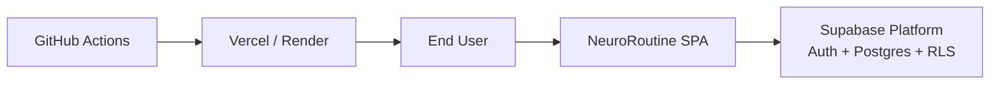
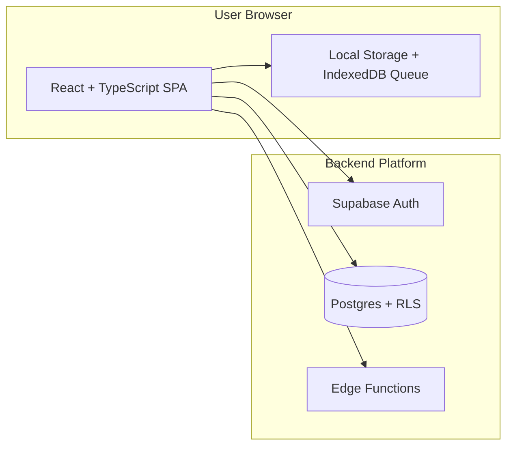
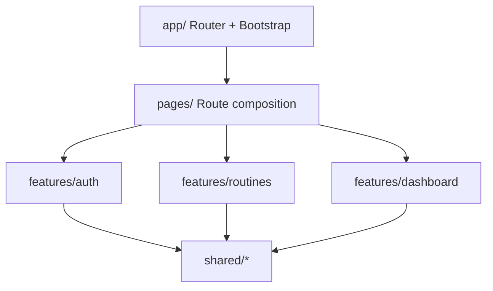
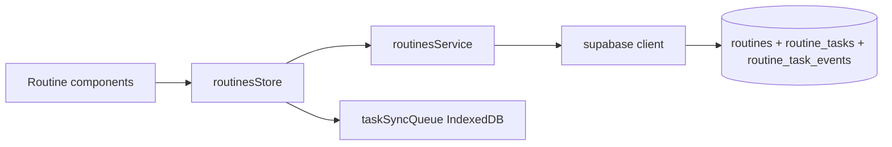

# C4 Architecture

This document describes NeuroRoutine architecture with C4-style views.

## Level 1 - System Context

## Level 2 - Container View

## Level 3 - Component View (Frontend)

## Level 4 - Code View (Routines Feature)

## Notes

- Security boundary is the database via RLS, not only client-side guards.
- Offline queue reduces data loss risk during temporary disconnections.
- CI gates enforce minimum quality before deployment.
